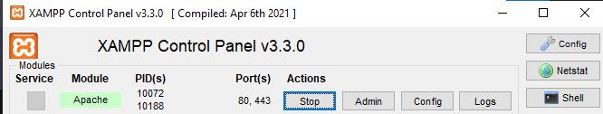
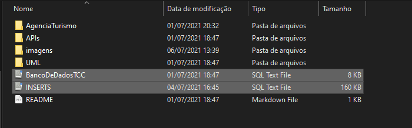
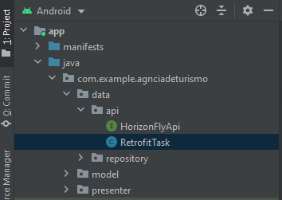
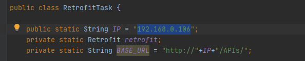

# Sobre - Parte Mobile

Aplicativo de uma agência de turismo que se conecta com o sistema podendo comprar os pacotes através do aplicativo. Foi feito com a arquitetura MVVM e utilizado Java, Kotlin e o PHP para criar APIs que se conecta com o sistema, usando o banco de dado MySql para armazenar os dados do cliente e da compra e o Firebase para realizar a autenticação do Login e guardar a foto do cliente.

## Orientações :man_teacher:

- É necessário ter o Xampp instalado e estar com o Apache iniciado

- É necessário dá um CREATE em todas as TABLES e depois todos os  INSERTS que estão no

- Por final é necessário ir na classe RetrofitTask e mudar a variável IP com o seu IP da sua máquina

  

  

## Mobile :mobile_phone_off:

- [x] Java, Kotlin e PHP

- [x] MVVM
- [x] MySql e Firebase
- [ ] Testes unitários e Instrumentados (Em andamento)

## Web :coffee:

- [x] C#, JAVASCRIPT, HTML, CSS
- [x] MVC
- [x] MySql
- [x] Repositório: https://github.com/JuliaCastro-dev/Ecommerce_HorizonFly

### Responsáveis :rocket:

- Daniel Santos Ribeiro - Desenvolvedor Mobile e Designer Mobile https://github.com/DanielSRibeiro

- Julia Castro - Front-end, Back-end, Banco de Dados e Designer Web https://github.com/JuliaCastro-dev
- Vitor Lopes - Banco de dados https://github.com/VitorLopesRodrigues
- Milena - Analista de Infraestruitura
- João Miziara - Analista